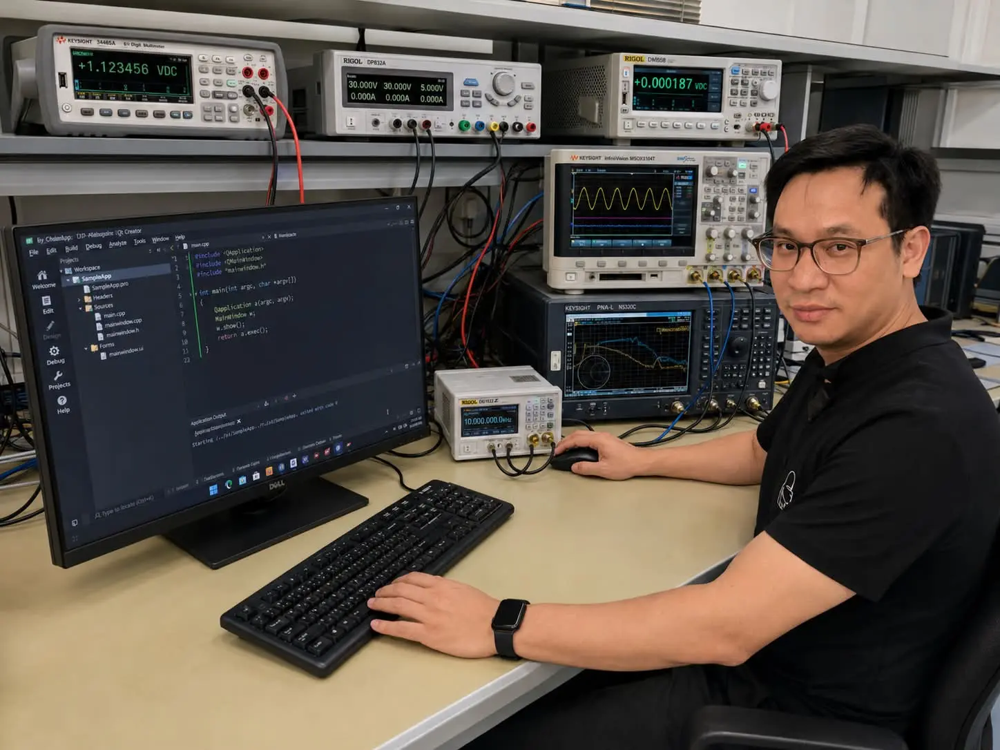
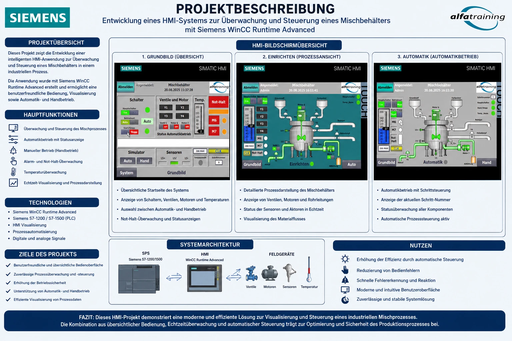
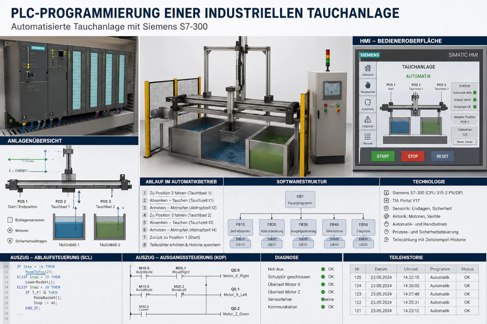
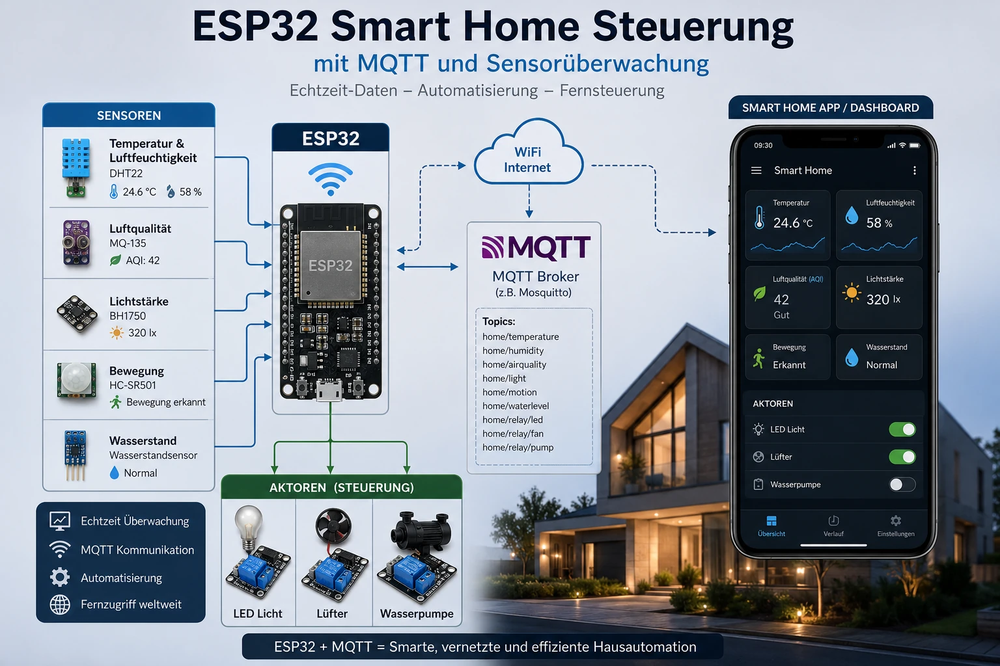

# ElektronikLab

Personal portfolio and technical blog for electronics, automation, embedded systems and engineering projects.

[](https://nguyennhando.github.io/my-electronics-blog/)



## Overview

ElektronikLab documents practical projects, technical concepts and learning progress in areas such as electronics, measurement technology, industrial automation and software development.

The website is built as a static React application and deployed through GitHub Pages. Blog posts and homepage content are stored as Markdown files and loaded at build time.

## Featured Projects

| Industrial process visualization | PLC-controlled diving system |
| --- | --- |
|  |  |

| Smart Home with ESP32 | AutoCAD steam engine |
| --- | --- |
|  |  |

## Features

- Responsive portfolio and technical blog
- Markdown-based project articles with frontmatter
- Categories, tags, search and project status filters
- Project image galleries and external project links
- Editable homepage card for the personal journey section
- Local-only Markdown editor for creating and updating content
- Content Security Policy for the production website

## Tech Stack

- React
- Vite
- Tailwind CSS
- Framer Motion
- React Markdown
- Lucide React
- GitHub Pages

## Getting Started

Install the dependencies and start the development server:

```bash
npm install
npm run dev
```

Create a production build:

```bash
npm run build
```

## Content Management

Blog posts are stored in `src/content/`. Images are stored in `public/images/`.

Start the local Markdown editor:

```bash
npm run admin
```

The editor is intentionally available only during local development. It is removed from the production bundle and cannot be opened through the public GitHub Pages website.

In Chrome or Edge:

1. Create a new post or select an existing post.
2. Edit the content and preview the result.
3. Click `In Ordner speichern`.
4. Select `src/content/` the first time.
5. Add referenced images to `public/images/posts/`.
6. Deploy the updated website.

Use `Persönlicher Weg bearbeiten` in the local editor to update the homepage card. Its content is stored in `src/content/personal-way.md`.

## Markdown Format

Each blog post starts with frontmatter:

```md
---
id: esp32-mqtt-gateway
slug: esp32-mqtt-gateway
title: ESP32 als MQTT-Gateway
category: IoT
image_url: /my-electronics-blog/images/posts/ESP32-main.webp
image_gallery:
- /my-electronics-blog/images/posts/detail-1.webp
tags:
- ESP32
- MQTT
read_time: 5 Min.
published: true
created_at: '2026-05-30T10:00:00.000Z'
external_link: ''
project_status: done
sort_order: 100
---

# ESP32 als MQTT-Gateway

Post content...
```

Supported `project_status` values:

- `idea`
- `in_progress`
- `done`

Lower `sort_order` values appear first.

## Project Structure

```text
public/
  images/             Static website and project images
src/
  components/         Shared UI components
  content/            Markdown posts and homepage content
  lib/posts.js        Markdown loading and frontmatter parsing
  App.jsx             Application UI
  index.css           Tailwind CSS entrypoint
  main.jsx            React entrypoint
```

## Deployment

Deploy the production build to GitHub Pages:

```bash
npm run deploy
```

The Vite base path is configured for:

```text
/my-electronics-blog/
```

## Security Notes

- The public website is static and does not expose an admin login, database or write API.
- The local Markdown editor is removed from production builds.
- A Content Security Policy is defined in `index.html`.
- Published images are stripped of metadata before deployment.
- Never commit credentials, API keys, private documents or environment files.
